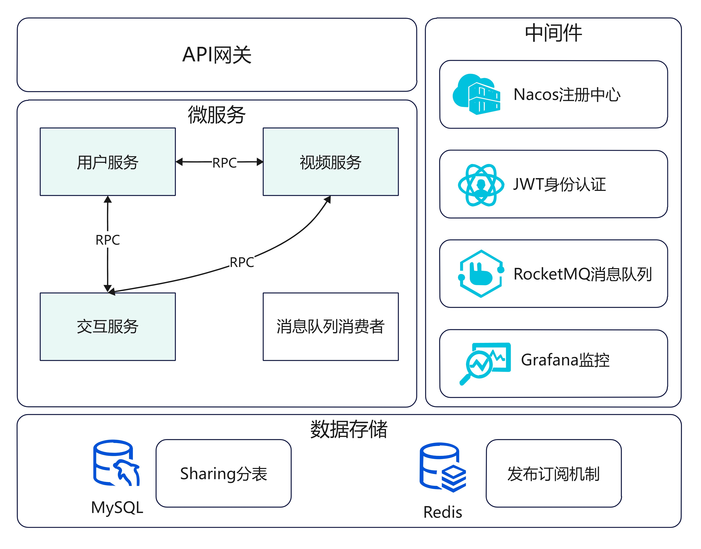
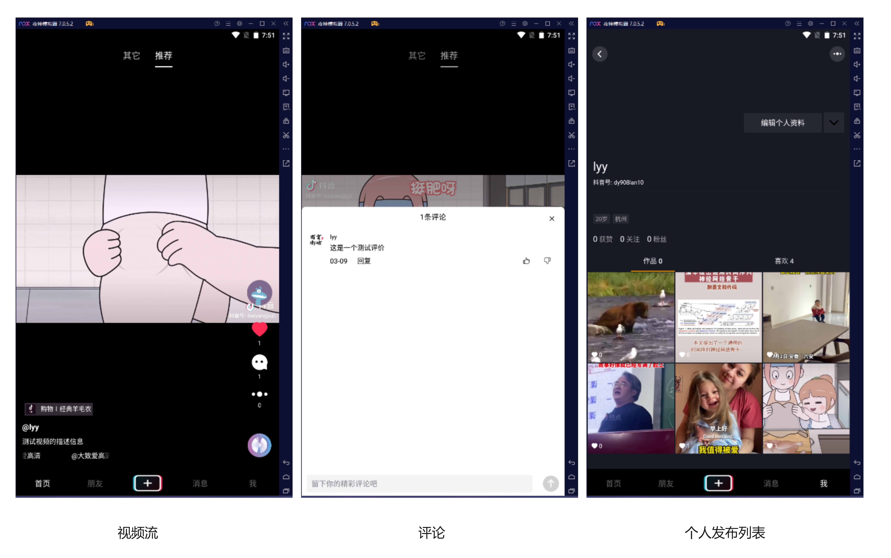
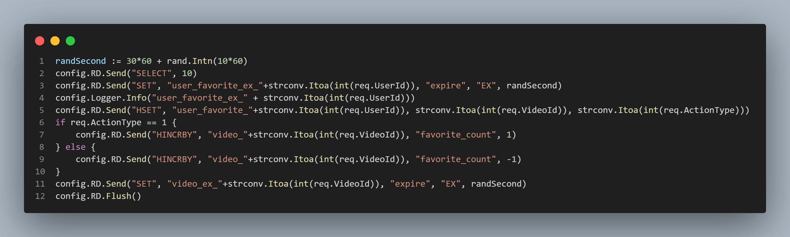
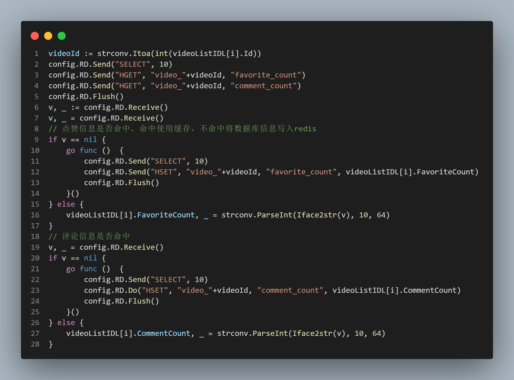

# mini-douyin
基于Golang的抖音微服务后端，实现了用户管理、视频上传、抓取、点赞和评论功能。

主要特色如下:

- 密码加盐
- JWT身份鉴权
- MySQL数据库分表
- Redis数据库发布订阅通知
- RocketMQ消息队列批量更新视频信息和用户点赞信息
- ffmpeg生成视频的封面图片

## 一、项目架构

    

项目使用 Gin 提供REST API服务对前端暴露请求，Kitex 提供远程过程调用服务用于微服务之间的通信，使用 thrift 协议的 IDL 文件。使用 Nacos做服务注册和发现中心允许多个微服务运行，实现基于服务端的负载均衡。

使用 MySQL 和 Redis 做数据存储实现分表和发布订阅功能。使用 Grafana 作为监控框架，目前只添加了 MySQL 数据源，后续可以添加 Collector 等数据源。

使用 "github.com/appleboy/gin-jwt/v2" 提供的 JWT 中间件，使用 token 验证用户登陆状态，只需要存储在用户端，服务端不需要存储只需要验证即可。对于用户的密码加盐处理，数据库不存储密码明文，存储盐值和 hash 后的值。



## 二、快速开始

本项目提供了 shell 脚本可以一键运行，所有的日志信息都可以在`./logs`文件夹下看到，`./public`文件夹存储了用户上传的视频。

1. 安装 kietx 以编译 IDL 文件

```shell
go install github.com/cloudwego/kitex/tool/cmd/kitex@latest
go install github.com/cloudwego/thriftgo@latest
```

2. 为各个微服务编译 IDL 文件

```shell
cd mini-douyin
sh ./updateIDL.sh
```

3. 单机运行微服务

```shell
sh ./runStandAlone.sh
```

4. 运行 API 服务和消息队列消费服务

```shell
# 运行 API 服务
go run ./cmd/api/main.go

# 打开 redis 的键空间过期监听
redis-cli > CONFIG SET notify-keyspace-events "KEx"
# 运行消息队列消费服务
go run ./cmd/consumer/main.go
```

## 三、效果展示



## 四、核心功能介绍

### 4.1 用户点赞信息存储方案

**背景**：用户点赞操作是十分频繁的，我们都知道数据库写操作是很耗时的，如果用户每点赞一次就直接将信息写入数据库，那么对服务器将是巨大的压力。并且在存储空间上，如果有m个用户，n个视频，那么最坏的空间复杂度是O(mn)，对于抖音这么大体量的用户群体来说，用户数多视频更多，耗费的存储也更多，那么此时查询数据库的时间也会更长。

**解决方案**：我们首先对存储用户的点赞信息的 MySQL 表进行了分表（当然后续也可以分库，这里只分了3张表），并且借助了 Redis 的快速读写优势。在 Redis 中，为每个用户建立了一个 hashtable 格式的数据 $user\_favorite\_userid$，存储用户对某一个视频的操作 $<key, value> = <video\_id, action\_type>$。并且建立了一个有过期时间的字符串 $user\_favorite\_ex\_userid$ ，为了避免缓存雪崩，这个过期事件通过固定时间加随机时间的方式设计。如下
$$
ExpiredTime = FixedTime + RandomTime
$$
当用户点赞时，直接操作 Redis 数据库，并且设置过期时间。用户每次操作的时候，都会刷新这个过期时间，如果一段时间用户一直没有操作，键过期了，就代表可以将数据写入 MySQL 数据库。设置 Redis 监听键空间，订阅过期时间，将 MySQL 数据库写入操作发送给消息队列。由消息队列批处理更新工作。
为了避免缓存穿透，即在 Redis 中查不到数据时一直到数据库中查询，我们在视频流抓取的时候，就将用户对该视频的点赞信息缓存到 redis 中。

**代码**：为了避免多次 Redis 请求，使用批量命令的方式，也可以使用 lua 脚本的方式



**遗留问题**：没有考虑这个 hashtable 的容量限制，默认可以一直存。但是在实际场景中，一些视频用户不会刷第二次，完全在 hashtable 落盘后删除。

### 4.2 视频信息存储方案

**背景**：视频信息是用户经常访问的，比如视频的播放地址，点赞数量，评论数量等。如果每个用户来查看视频都直接从数据库中查询，将会浪费很多资源。使用缓存数据库的方式，当有修改时在落盘，可以大大提高速度。

**解决方案**：先查询 Redis 中的缓存，如果缓存命中，直接返回。如果没有命中，就查询 MySQL 数据库，然后同时写入 Redis 和返回给用户。如果用户修改数据，先修改 Redis 中的缓存，在设置一个过期计时器，当键过期时触发订阅事件，将视频信息再回写入 MySQL 数据库。通过延后落盘的方式，可以将一个视频的一段时间内的操作聚合成一个操作，大大减少数据库访问。

**代码**：对于不命中的情况，可以开启新的协程更新 Redis，并不关心是否成功，失败的话下一次请求还是不命中


**遗留问题**：对于非法数据的闯入，即再 Redis 和 MySQL 都不命中的情况，可以在 Redis 中做置空，拦截非法流量

### 4.3 其他功能杂项

密码加盐：使用长度为 10 的随机字符串拼接在用户密码后面，然后再使用 SHA256 加密，对于每个用户盐值都不一样，存储在数据库中。

## 五、Kitex RPC 框架使用

[Kitex官网快速开始](https://www.cloudwego.io/zh/docs/kitex/getting-started/)

[Kitex代码生成](https://www.cloudwego.io/zh/docs/kitex/tutorials/code-gen/code_generation/)


1. 安装 kitex 和 thriftgo

```shell
go install github.com/cloudwego/kitex/tool/cmd/kitex@latest
go install github.com/cloudwego/thriftgo@latest

# 升级框架
go get github.com/cloudwego/kitex@latest
go mod tidy
```

2. 生成服务端代码文件

```shell
# kitex -module "your_module_name" -service "your_service_name" hello.thrift

# userservice
cd cmd/user
kitex -module mini-douyin -service userservice ../../idl/user.thrift
# videoservice
cd cmd/video
kitex -module mini-douyin -service videoservice ../../idl/video.thrift
# socityservice
cd cmd/socity
kitex -module mini-douyin -service socityservice ../../idl/socity.thrift
kitex -module mini-douyin ../../idl/user.thrift
```

3. 生成客户端代码文件

```shell
cd cmd/api
kitex -module mini-douyin ../../idl/user.thrift
kitex -module mini-douyin ../../idl/video.thrift
kitex -module mini-douyin ../../idl/socity.thrift
```

4. 编译运行

```shell
sh build.sh
sh output/bootstrap.sh
```